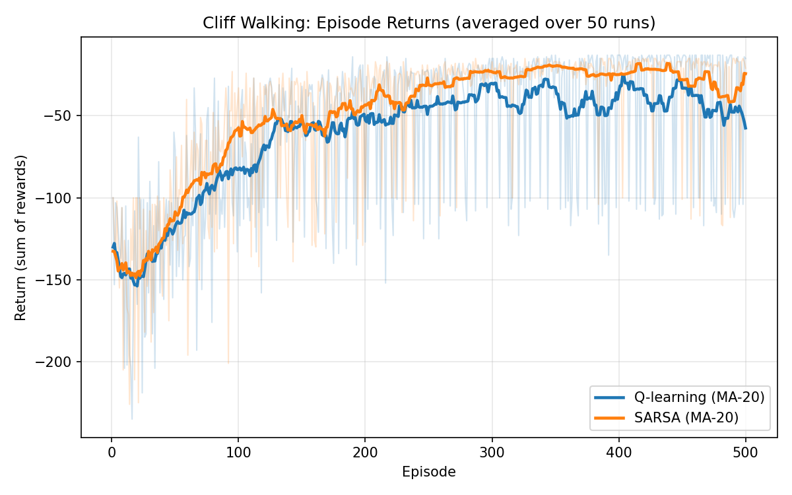
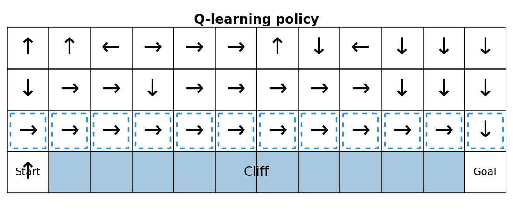

# DRL HW2: Q-learning vs SARSA (Cliff Walking)

本專案比較兩種 TD 控制方法在 Cliff Walking 環境中的表現：
- Q-learning（Off-policy）
- SARSA（On-policy）

核心目標是比較三件事：
- 學習表現（每回合累積獎勵曲線）
- 最終策略行為（路徑是否貼近懸崖）
- 穩定性（訓練波動與 exploration 影響）

## Environment
- Grid: `4 x 12`
- Start: 左下角
- Goal: 右下角
- Cliff: 底列起點與終點之間
- Reward:
  - 一般步移：`-1`
  - 進入懸崖：`-100`

## Training Setup
- Baseline setting:
  - `episodes = 500`
  - `runs = 50`（取平均）
  - `epsilon = 0.1`
  - `alpha = 0.1`
  - `gamma = 0.9`
- Epsilon comparison:
  - `epsilon in [0.01, 0.1, 0.3]`
  - 額外做輕量 sweep 比較 exploration 影響

## Results (PNG)

### 1. Baseline reward curve (50-run average)


說明：
- 兩種方法都能隨訓練提升回報。
- Q-learning 與 SARSA 收斂速度接近，但波動特性不同。

### 2. Final policy: Q-learning


說明：
- Q-learning 常學到較貼近懸崖的短路徑。
- 在有探索時可能承擔較高風險。

### 3. Final policy: SARSA


說明：
- SARSA 傾向保守路徑，與懸崖保持更安全距離。
- 在持續探索下通常更穩健。

### 4. Epsilon comparison


說明：
- `epsilon` 增大時（探索更強），兩者回報都下降。
- 中高探索下，SARSA 通常比 Q-learning 更穩定。

## Key Takeaways
- Q-learning（Off-policy）
  - 更新使用 `max_a Q(S', a)`。
  - 傾向理論最優，但高探索時可能較冒險。
- SARSA（On-policy）
  - 更新使用實際下一動作 `Q(S', A')`。
  - 會反映探索策略影響，通常較保守、較穩定。

## How To Run
在專案根目錄執行：

```bash
python -m hw2.train
```

執行後會產生/更新：
- `reward_curve_50runAverage.png`
- `Q_learning_policy.png`
- `Sarsa_policy.png`
- `reward_curve_epsilon_comparison.png`

## Report
完整分析請見：
- `HW2_Qlearning_vs_SARSA_Report.md`
- `HW2_Qlearning_vs_SARSA_Report.pdf`

## Scripts
- `startup.cmd` / `startup.ps1`: 抓取或更新專案內容
- `ending.cmd` / `ending.ps1`: 快速 commit + push（可自訂 commit message）
