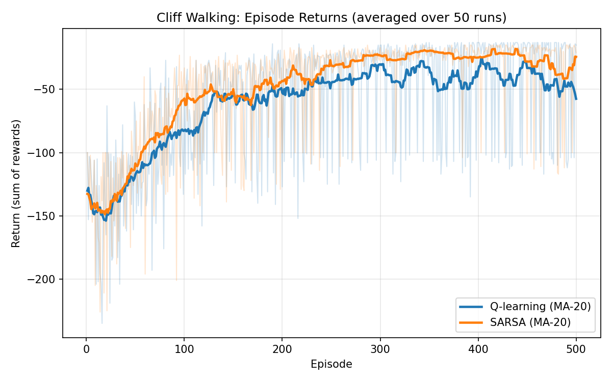
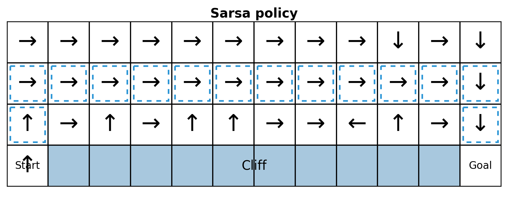
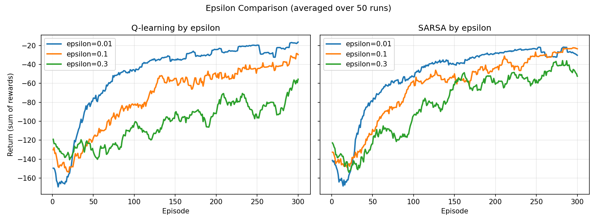

# HW2 Report: Q-learning vs. SARSA in Cliff Walking

## 實驗設定
- 環境：Cliff Walking `4 x 12`。
- 起點/終點：左下角為起點、右下角為終點。
- 懸崖區：底列起點與終點之間。
- 演算法：Q-learning（Off-policy）與 SARSA（On-policy）。
- 參數：`epsilon = 0.1`, `alpha = 0.1`, `gamma = 0.9`。
- 訓練回合：每次 `500 episodes`，共 `50 runs` 取平均。
- 視覺化：
  - 學習曲線：`reward_curve_50runAverage.png`
  - 最終策略圖：`Q_learning_policy.png`, `Sarsa_policy.png`

---

## 1. 比較與討論

### 1.1 學習表現（Total Reward 曲線 + 收斂速度）

- 兩種方法在前期都由較低回報快速提升，代表都能有效學到可行策略。
- 在中後期，兩者平均回報逐漸趨於平穩，但仍可見部分波動。
- 收斂速度比較：
  - 依目前曲線趨勢，**兩者收斂速度接近**。
  - Q-learning 在部分區段上升較快，但後期受探索影響仍有較明顯下探。
  - SARSA 整體提升較平滑，進入穩定區的過程較連續。

### 1.2 策略行為（最終路徑 + 冒險/保守）

- Q-learning 最終策略通常更貼近懸崖邊緣的「短路徑」，因為其更新目標偏向理論上的最大未來價值。
- SARSA 最終策略通常更傾向保留安全距離，路徑較保守，避免在探索期間頻繁踩入懸崖。
- 冒險/保守分析：
  - **Q-learning 較冒險**：追求理論最優路徑，但在 `epsilon-greedy` 探索下，靠近懸崖時一旦隨機動作就有較高風險。
  - **SARSA 較保守**：因更新直接反映「實際會探索」的行為，學到的策略自然避開高風險區。

### 1.3 穩定性分析（波動程度 + exploration 影響）

- 波動程度比較：
  - Q-learning 曲線通常出現較深的偶發下探（例如探索導致踩懸崖）。
  - SARSA 波動相對較小，整體表現較平順。

#### exploration 影響（epsilon 比較實驗）

本次另外進行 epsilon sweep（`epsilon = 0.01, 0.1, 0.3`）比較，設定如下：
- 每個 epsilon 以 `5 runs`、每次 `300 episodes` 估計趨勢。
- 指標採用「最後 100 回合平均回報（Last-100 Avg Return）」。

實驗結果如下：

| Epsilon | Q-learning Last-100 | SARSA Last-100 |
|---|---:|---:|
| 0.01 | -23.320 | -26.500 |
| 0.10 | -43.680 | -31.830 |
| 0.30 | -78.860 | -51.650 |

觀察與討論：
- 當 `epsilon` 從 `0.01` 提高到 `0.30`，兩種方法回報都明顯下降，表示探索增加會帶來更多高代價失誤（踩懸崖）。
- 在低探索（`epsilon=0.01`）下，Q-learning 表現略優，顯示其較能逼近高回報路徑。
- 在中高探索（`epsilon=0.1, 0.3`）下，SARSA 明顯優於 Q-learning，顯示 SARSA 對持續探索更穩健。
- 這與理論一致：Q-learning 使用 `max_a Q(S',a)`，在高探索實際行為下易出現「目標過於樂觀」；SARSA 使用 `Q(S',A')`，可直接反映探索策略造成的風險。

---

## 2. 重要概念說明

### 2.1 Q-learning（Off-policy）
- Q-learning 為**離策略（Off-policy）**方法。
- 更新使用下一狀態的最佳可能行動：
  - \(Q(S,A) \leftarrow Q(S,A) + \alpha [R + \gamma \max_a Q(S',a) - Q(S,A)]\)
- 重點在於：即使下一步實際執行的不是最佳行動，更新仍使用 `max_a Q(S',a)`，因此偏向學習理論最優值函數。

### 2.2 SARSA（On-policy）
- SARSA 為**同策略（On-policy）**方法。
- 更新使用下一步「實際採取」的行動：
  - \(Q(S,A) \leftarrow Q(S,A) + \alpha [R + \gamma Q(S',A') - Q(S,A)]\)
- 因為 `A'` 是在目前探索策略（如 epsilon-greedy）下選出的行動，故更新結果會直接反映探索策略帶來的風險。

### 2.3 一般性結論（理論觀點）
- **Q-learning**：傾向學到理論上的最優策略，但訓練過程中可能較具風險。
- **SARSA**：傾向學到在實際探索策略下較安全、較穩定的策略。

---

## 3. 本實驗總結

### 3.1 兩種方法在本實驗中的差異
- 共同點：都能在 Cliff Walking 中有效提升回報，並在中後期進入較穩定區間。
- 差異點：
  - Q-learning 較追求短路徑，對探索擾動較敏感。
  - SARSA 較重視實際執行安全性，整體波動較小。

### 3.2 哪一種收斂較快？
- 本次結果顯示：**兩者收斂速度接近**，但 Q-learning 在部分階段上升較快，SARSA 則以較平穩方式進入穩定區。

### 3.3 哪一種較穩定？
- 本次結果顯示：**SARSA 較穩定**（波動較小、受探索干擾較低），且在 `epsilon=0.1` 與 `epsilon=0.3` 時優勢更明顯。

### 3.4 何時選擇 Q-learning 或 SARSA？
- 適合選擇 Q-learning 的情境：
  - 追求理論最優策略。
  - 可接受訓練期間較高風險或偶發大損失。
  - 探索比例可隨時間顯著下降（例如後期接近純 exploitation）。
- 適合選擇 SARSA 的情境：
  - 需要訓練過程與部署策略都更穩健。
  - 環境中高風險區域（如懸崖）代價很高。
  - 需要策略在持續探索下仍保持相對安全。

---

## 補充建議
- 若要更清楚比較「穩定性」，可再加入數值指標：
  - 每 50 回合的回報標準差（Std）。
  - 移動平均曲線的方差或振幅。
- 若要更公平比較最終性能，可在訓練後以 `epsilon=0` 進行 evaluation episodes，分開觀察「學到的策略品質」與「探索期波動」。
